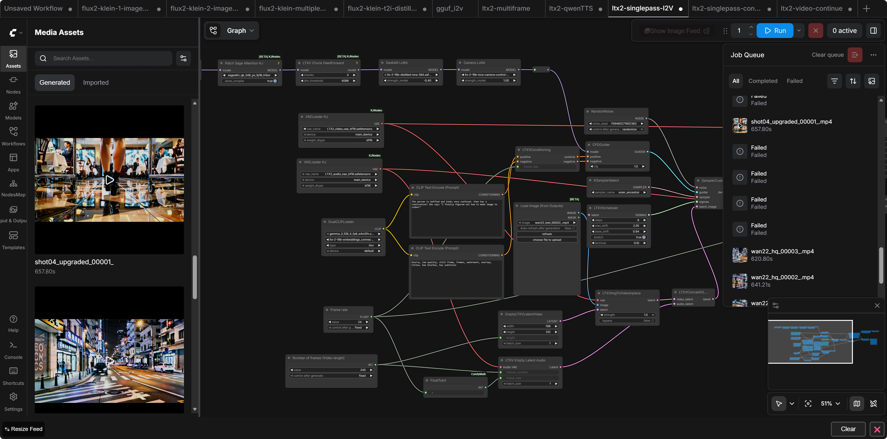
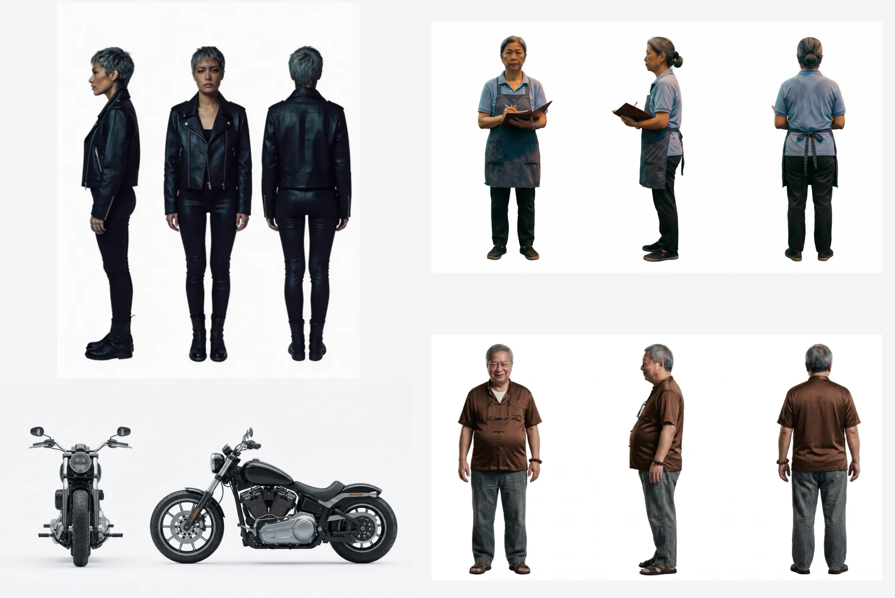
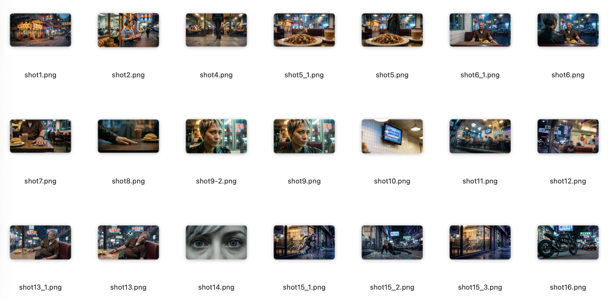
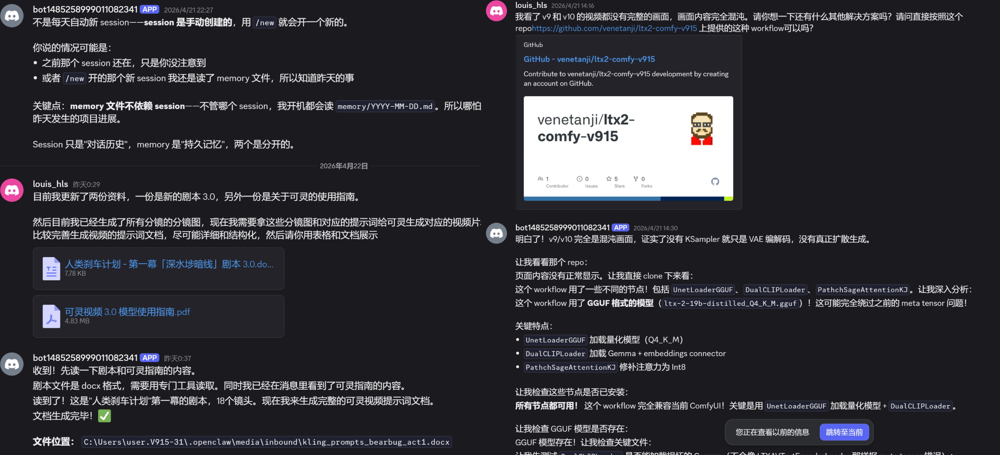

# Human Brake Plan

> AI Short Film Project, Hong Kong Noir, Science Fiction

## About

**Human Brake Plan** is an experimental AI short film, inspired by the screenplay of [Chen Qiufan (陈楸帆)](https://en.wikipedia.org/wiki/Chen_Qiufan).

A late-night USB drive handoff in a Sham Shui Po tea restaurant — interrupted by a single gunshot. Robin seizes the drive and runs, leading police through the dense streets and neon-lit alleys of Hong Kong on a modified motorcycle, until she disappears off the edge of a West Kowloon overpass into the night.

## 🎬 Final Output

> **Demo video temporarily unavailable — this is a commercial project.**
> Only the thematic poster is available for public reference.


---

## Story Structure

The original screenplay is divided into four acts:

| Act | Content | Contributor |
|-----|---------|-------------|
| Act 1 | Opening dialogue scene | **Louis** |
| Act 2-3 | Hong Kong chase scenes | **Huang Yishu** + **Jing Xin** |
| Act 4 | Chase finale | **Leo Zhu** |

---

## Team

| Name | Role | Contribution |
|------|------|-------------|
| **Louis Huang（黄柳森）** | Contributor | script, storyboard, repo management |
| **Huang Yishu (黄奕舒)** | Contributor | asset generation, storyboard, chase scene visuals |
| **Jing Xin (辛怡静)** | Contributor | chase scene visuals, audio generation |
| **Leo Zhu (朱智立)** | Project Lead | script, chase finale, editing, director |
| **Xiao Zhi (小志)** | AI Agent | Workflow design, prompt engineering, video generation |


---

## How We Work

**Production Pipeline:**

> Script → Character Reference → Prompt Engineering → Storyboard → AI Reference Images → AI Video → Audio → Editing → Final Output

Prompt engineering is the shared skill that ties every stage together. Each act uses a different set of AI tools to execute this pipeline.

### Division of Labour

The project is divided into four acts, each owned by a different contributor. Louis manages the repo and overall structure; Leo Zhu oversees the story's arc as project lead. Each person works independently on their act — from script through to video generation — using their own preferred tools and workflow.

### Act 1 · Louis

Responsible for the opening scene: the late-night tea restaurant, the U盘handoff, the gunshot, and Robin's first escape onto the street. Handled script adaptation, shot-by-shot storyboard, prompt engineering, and video generation.

Approach: Wrote the screenplay, generated FLUX storyboard images with detailed cinematic prompts, then used KLing 3.0 for the final video output with local Wan 2.2 testing as a backup pipeline.





### Acts 2–3 · Huang Yishu + Jing Xin

Responsible for the full chase sequence across Hong Kong's streets and landmarks. Yishu focused on asset creation and visual reference generation; Jing handled the video work and produced the music.

Approach: Used Stable Diffusion v1.5 to generate reference images for each scene, then ran them through HunyuanVideo 1.5 I2V for video generation. Multiple versions were produced per shot to compare quality and select the best result. Jing created the music separately in Suno.


### Act 4 · Leo Zhu

Responsible for the closing act and the final edit. Oversaw the cargo ship finale and assembled all four acts into a complete narrative.

Approach: Directed the final act's visuals, then handled post-production editing to ensure continuity across all four acts.


### Integration · Leo Zhu

When all four acts are complete, they are assembled into the final film. Leo Zhu oversees the edit and the overall narrative arc, ensuring the four acts flow together as one continuous story. Music and voice tracks are layered in during post-production.


### Collaboration Model

We set up a Discord group with four teammates and one OpenClaw AI agent. For anything technical — a model that won't load, a workflow that's producing blank output, a tool we haven't used before — we ask the bot directly in the group chat. The bot researches the problem, runs tests, and comes back with answers and solutions.



---

## AI Agent Collaboration

This project uses **OpenClaw** AI Agent **Xiao Zhi (小志)** as a technical collaborator, working alongside the team in real-time through **Discord** voice and text.

Unlike a passive assistant, Xiao Zhi takes initiative — researching models, debugging workflows, and proposing solutions without being asked. The collaboration model is closer to a junior technical partner than a chatbot.

**What Xiao Zhi handles:**
- ComfyUI workflow design and debugging
- Prompt engineering (KLing 3.0, FLUX, Wan 2.2, LTX 2.3)
- Python/PowerShell scripting for batch processing
- Technical research on AI video models and tools
- Repository structure and documentation

**Key technical contributions:**
- Discovered and resolved T2V vs I2V model mismatch causing black output in Wan 2.2
- Designed the correct Wan 2.2 I2V node chain (UNETLoader → VAELoader → Wan22ImageToVideoLatent → VAEDecode → CreateVideo)
- Researched and documented LTX 2.3, venetanji/ltx2-comfy-v915 workflows
- Set up ComfyUI batch processing scripts for multi-shot video generation

All collaboration records are preserved in [openclaw_agent/](openclaw_agent/).

---

## Repository Structure

```
human-brake-ai-video/
├── louis/              ← Act 1 (Louis)
│   ├── script/         ← Act 1 scripts
│   ├── storyboard/     ← Act 1 storyboard images
│   ├── prompts/        ← Act 1 video prompts
│   └── workflows/      ← Act 1 workflows
│
├── huangyishu/        ← Act 2-3 (黄奕舒)
├── jing/               ← Act 2-3 (辛怡静)
├── leozhu/             ← Act 4 (朱智立)
│
├── script/             ← Shared: original screenplay
├── workflows/          ← Shared: ComfyUI workflows
├── audio/              ← Shared: background music
├── voice/              ← Shared: voice acting
├── assets/             ← Shared: character reference sheets
└── docs/               ← Project documentation & workflow screenshots
```

> Each team member manages their own folder. Shared resources are at the root level.

---

## Tech Stack

**AI Video Generation**
- KLing 3.0 — image-to-video (main production tool)
- FLUX — storyboard image generation
- Wan 2.2 — local I2V testing (ComfyUI)
- HunyuanVideo 1.5 — local I2V (腾讯混图, ComfyUI)
- LTX 2.3 — local I2V testing (ComfyUI)
- Stable Diffusion v1.5 — reference image generation

**AI Music**
- Suno — background music generation

**Tools**
- ComfyUI — node-based video workflow
- OpenClaw — AI agent collaboration platform
- Discord — real-time team communication
- GitHub — project version control

---

## License

MIT License

---

*Human Brake Plan · 2026*
